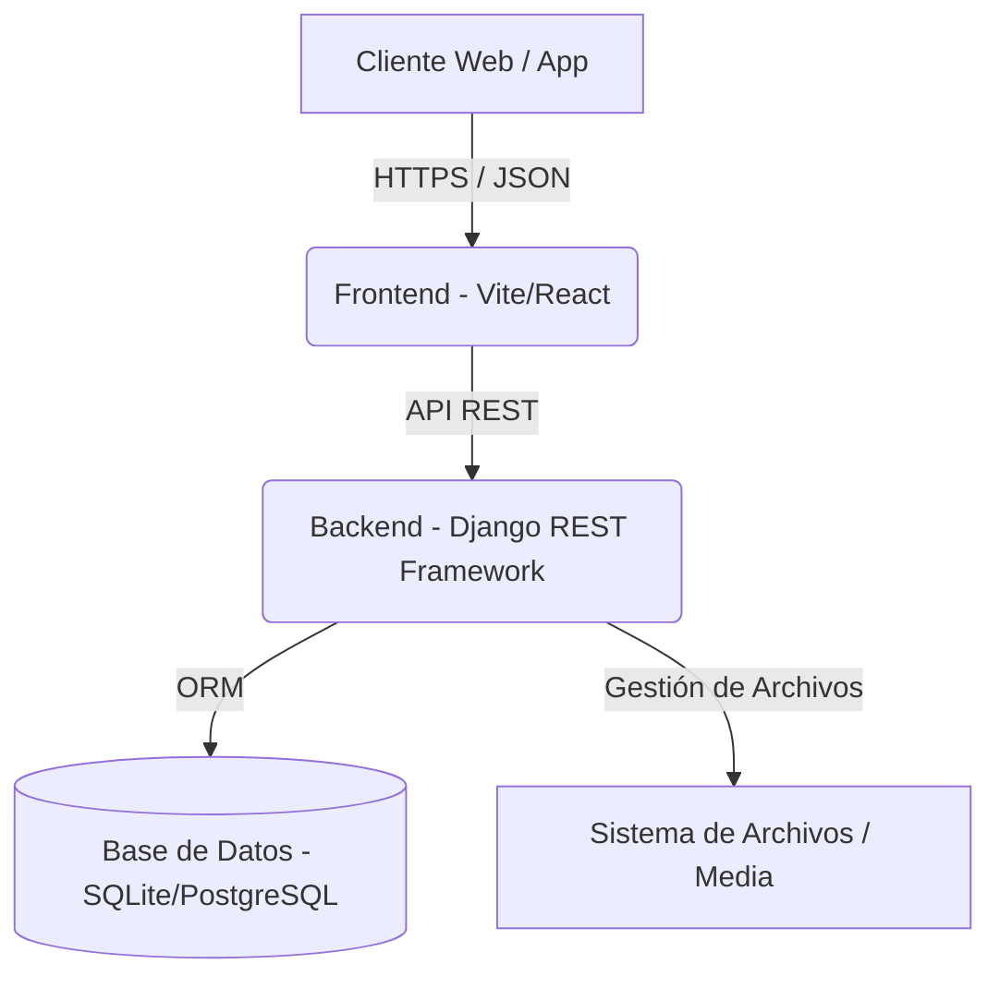

# SABBATH
### *Redefiniendo el Paisaje Digital*

---

## 1. Visión Ejecutiva

Bienvenido al repositorio central de **Sabbath**. Este monorepo alberga la arquitectura integral de nuestra plataforma digital de vanguardia, diseñada para ofrecer experiencias de usuario inmersivas y un rendimiento de backend robusto y escalar.

El proyecto está estructurado estratégicamente en dos componentes principales:
*   **Backend Core**: API RESTful de alto rendimiento basada en Django.
*   **Frontend Client**: Interfaz de usuario reactiva y moderna construida con Vite y React.

Esta documentación sirve como punto de entrada autoritativo para desarrolladores, arquitectos y stakeholders técnicos.

---

## 2. Arquitectura del Sistema

La solución tecnológica se ha diseñado siguiendo patrones de arquitectura limpia y separación de responsabilidades.

### Estructura de Directorios

*   `/backend` - Lógica de negocio, gestión de datos y APIs.
*   `/frontend` - Capa de presentación, componentes UI y lógica de cliente.

---

## 3. Inicio Rápido (Quick Start)

Para desplegar el entorno de desarrollo completo, siga estos pasos críticos:

### Prerrequisitos
*   **Python** 3.10+
*   **Node.js** 18+
*   **Git**

### Procedimiento de Despliegue
1.  **Clonar Repositorio**: `git clone <url-del-repo>`
2.  **Configurar Backend**:
    *   Navegar a `/backend`
    *   Crear entorno virtual: `python -m venv venv`
    *   Activar entorno e instalar dependencias: `pip install -r requirements.txt`
3.  **Configurar Frontend**:
    *   Navegar a `/frontend`
    *   Instalar paquetes: `npm install`

---

## 4. Estándares y Gobernanza

El desarrollo dentro de este proyecto se adhiere estrictamente a estándares de la industria para asegurar mantenibilidad y escalabilidad.

*   **Commits**: Conventional Commits (e.g., `feat:`, `fix:`, `chore:`).
*   **Estilo de Código**: PEP8 para Python, ESLint/Prettier para JavaScript.
*   **Seguridad**: No subir credenciales o secretos al repositorio (`.env` está ignorado).

---

**© 2025 Sabbath Project. Todos los derechos reservados.**
*Documentación confidencial y propietaria.*
