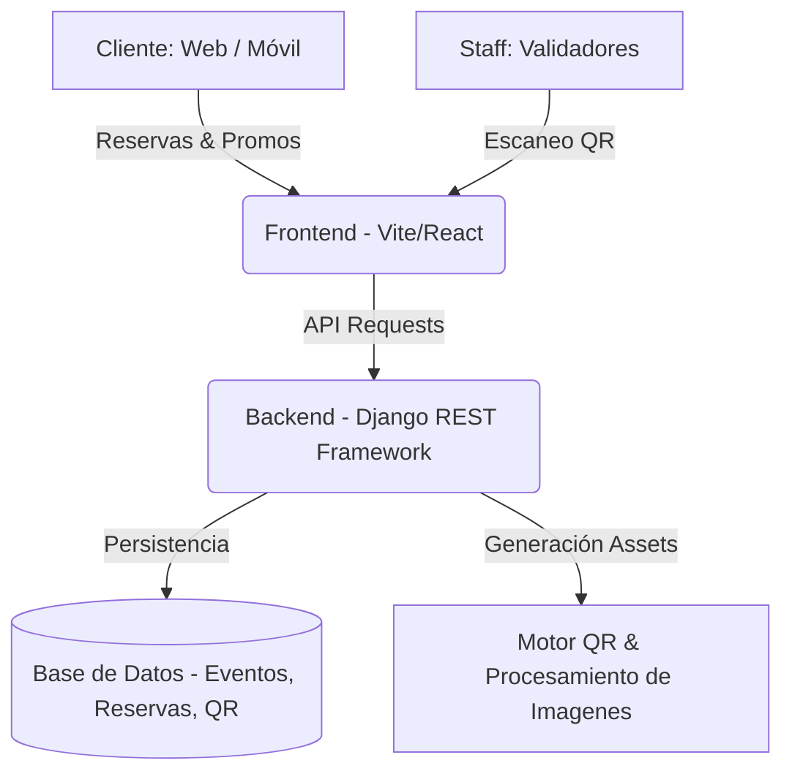

# SABBATH
### *Sistema de Gestión Integral para Nightclubs & Entretenimiento*

---

## 1. Visión Ejecutiva

Bienvenido al repositorio central de **Sabbath**. Este monorepo alberga la arquitectura integral de nuestra plataforma digital de vanguardia, diseñada específicamente para la **gestión 360° de bares y clubes nocturnos**.

El sistema digitaliza la experiencia del cliente y la operación del local, ofreciendo una solución robusta para el control de acceso, marketing y gestión de aforo en tiempo real.

### Capacidades del Negocio
El proyecto no es solo un sitio web, sino un **Enterprise Resource Planning (ERP)** ligero enfocado en la vida nocturna que incluye:

*   **Gestión de Eventos y Aforo**: Administración centralizada de carteleras, fechas y control de capacidad máxima.
*   **Sistema de Reservas Inteligente**: Generación automática de **Códigos QR** únicos por reserva, validados en puerta para un acceso fluido y seguro.
*   **Experiencia Digital (Menu & Promos)**: Despliegue de menús digitales y campañas de marketing ("Promos") con tickets QR canjeables (ej. cortesías, descuentos).
*   **Control de Acceso e Identidad**: Registro de asistentes con validación de DNI para seguridad y analítica de clientes.

---

## 2. Arquitectura del Sistema

La solución tecnológica se ha diseñado siguiendo patrones de arquitectura limpia y separación de responsabilidades.

### Estructura de Directorios

*   `/backend` - **Core Logic**: Modelos de datos (Eventos, Tickets, Menús), generación de códigos QR (Python/Pillow), y API REST segura.
*   `/frontend` - **User Experience**: Interfaz reactiva para clientes (Landing, Reservas) y staff (Validadores de QR).

---

## 3. Inicio Rápido (Quick Start)

Para desplegar el entorno de desarrollo completo, siga estos pasos críticos:

### Prerrequisitos
*   **Python** 3.10+
*   **Node.js** 18+
*   **Git**

### Procedimiento de Despliegue
1.  **Clonar Repositorio**: `git clone <url-del-repo>`
2.  **Configurar Backend**:
    *   Navegar a `/backend`
    *   Crear entorno virtual: `python -m venv venv`
    *   Activar entorno e instalar dependencias: `pip install -r requirements.txt`
3.  **Configurar Frontend**:
    *   Navegar a `/frontend`
    *   Instalar paquetes: `npm install`

---

## 4. Estándares y Gobernanza

El desarrollo dentro de este proyecto se adhiere estrictamente a estándares de la industria para asegurar mantenibilidad y escalabilidad.

*   **Commits**: Conventional Commits (e.g., `feat:`, `fix:`, `chore:`).
*   **Estilo de Código**: PEP8 para Python, ESLint/Prettier para JavaScript.
*   **Seguridad**: No subir credenciales o secretos al repositorio (`.env` está ignorado).

---

**© 2025 Sabbath Project.**
*Transformando la Experiencia Nocturna.*
